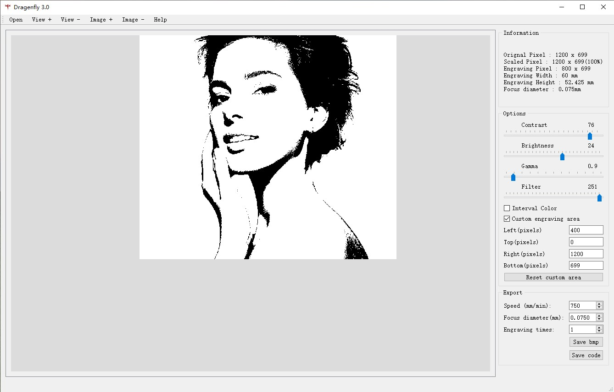

# LaserTool

Laser engraving function of 3D printer
This is an auxiliary software. The main function is to export files recognized by the 3D printer (NC, Gcode, and other formats).
The exported file format can be customized. What it exports is text.

## Contents

- [List of goods](#list-of-goods)
- [Assembly](#assembly)
- [Usage](#connection)
- [First run](#first-run)
- [Test print](#test-print)
- [Calibration](#calibration)
- [Slice model](#slice-model)
- [Advanced use](#advanced-use)
- [Update firmware](#update-firmware)
- [Firmware source code](#firmware-source-code)
- [Contact us](#contact-us)

&nbsp;
&nbsp;

## Usage

1. Engrave the image.
Import the image file into LaserTool and export the nc file.

`Image` -> `LaserTool` -> `nc file`.

https://raw.githubusercontent.com/MULTOO-3DPrinter/LaserTool/main/img/1.jpg

img/1.jpg

2. Character engraving.
Edit the text in inkscape, and then export the png format image. Change the format of the png format image to jpg, bmp, jpeg, etc., and then import it into the LaserTool and export the nc file.

`Edit the text in inkscape` -> `png file` -> `jpg, bmp, jpeg etc.` -> `LaserTool` -> `nc file`
